# Procesverslag
**Auteur:** Jon Kuijs

Markdown cheat cheet: [Hulp bij het schrijven van Markdown](https://github.com/adam-p/markdown-here/wiki/Markdown-Cheatsheet). Nb. de standaardstructuur en de spartaanse opmaak zijn helemaal prima. Het gaat om de inhoud van je procesverslag. Besteedt de tijd voor pracht en praal aan je website.

## Bronnenlijst
1.  container scroller https://codeburst.io/how-to-create-horizontal-scrolling-containers-d8069651e9c6
2.  omhoog scroll knop https://www.youtube.com/watch?v=Vef9bxTilCU
3.  Kleur switchen onder producten https://www.youtube.com/watch?v=9Irz0c-6UGw
4.  Javascript hamburger menu met hulp van martijn

## Eindgesprek (week 7/8)

De stijling van basis dingen gingen wel goed en als ik bezig was had ik er ook wel plezier in. Alleen liep ik vaak tegen problemen aan zoals complexe dingen die ik nog nooit heb gedaan en dan ook niet altijd even veel aan het internet had om dat iedereen javascript inline doet maar voor de meeste dingen hielp lang genoeg zoeken.

**Screenshot(s):**

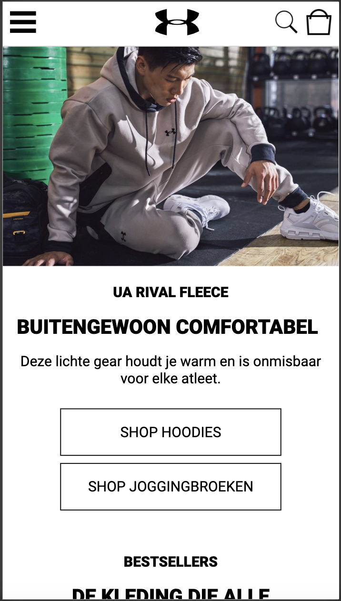
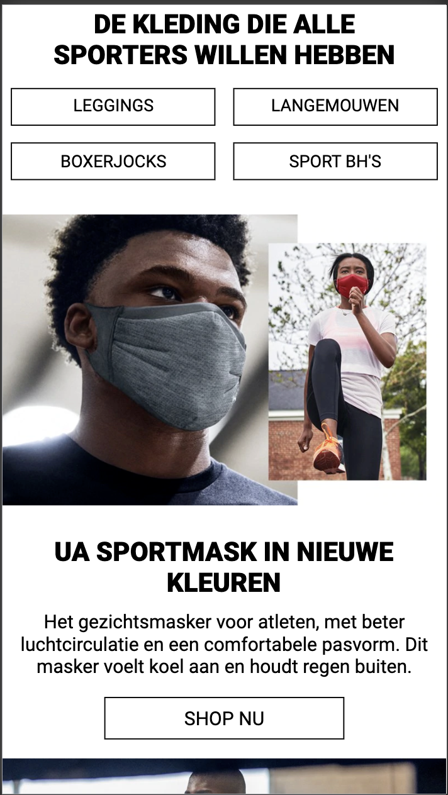
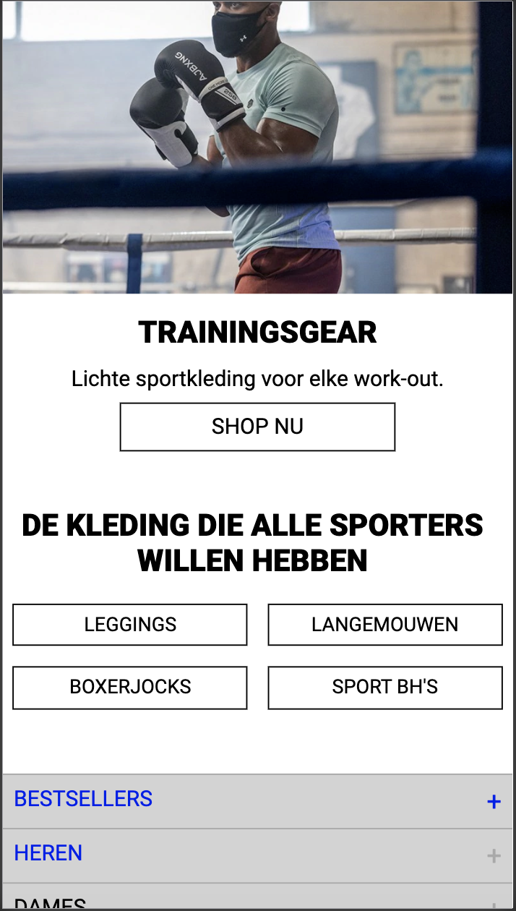
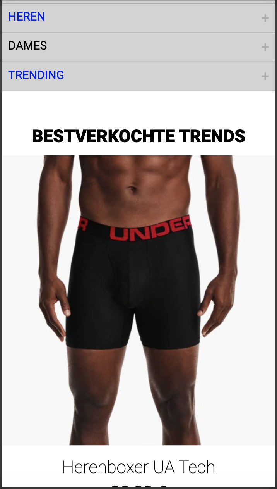
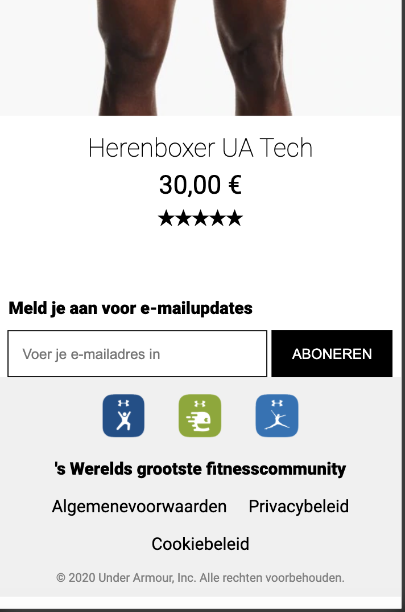
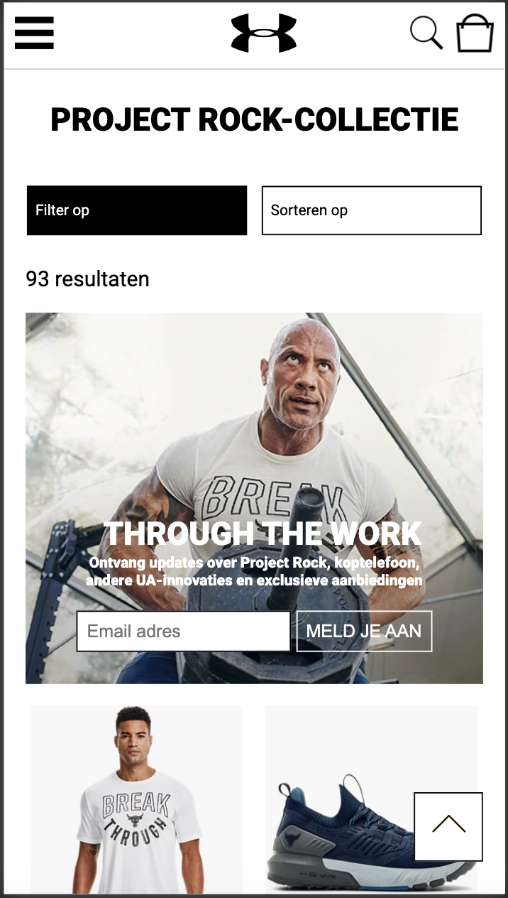
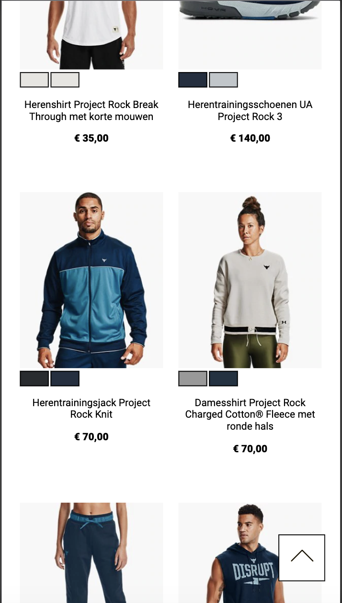
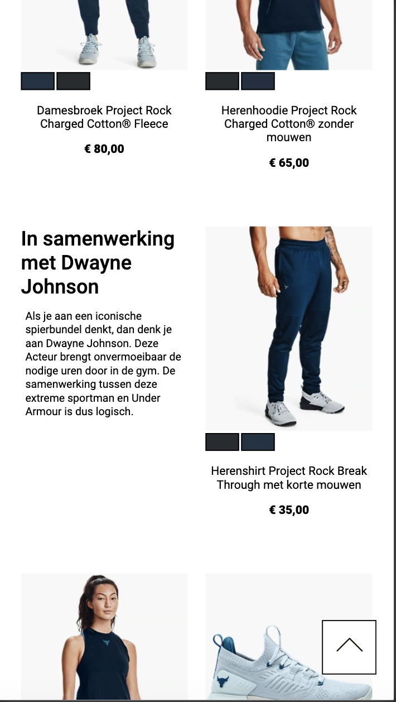
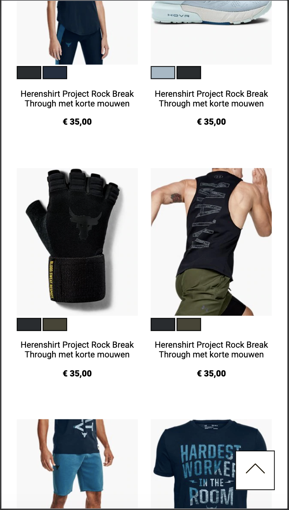
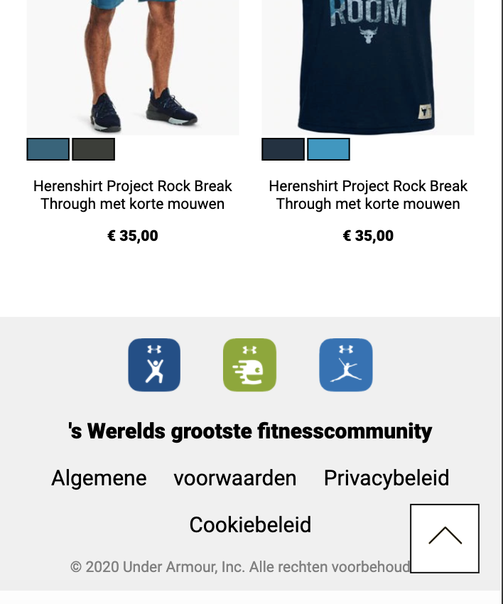

## Voortgang 3 (week 6)

-same as voortgang 1-
Surfaceplane besproken
- Hamburger menu uitklapbaar./filter (komt op het zelfde neer)
- Zoekbalk klapt uit
- Email validatie (states)
- Kleur veranderen producten
- Pijltje naar boven kant van de pagina.

## Voortgang 2 (week 5)
### Stand van zaken
Motivatie is gedaald en lastig om er verder aan te gaan tweede pagina komt goed op weg maar moet nog veel lastige dingen zoals javascript gaan doen. basis gaat meestal prima als ik er voor ga zitten maar de lastige dingen stel ik uit

## Voortgang 1 (week 3)

### Stand van zaken
De basis dingen en selectoren gingen goed maar als er nieuwe dingen kwamen was het vaak lastig omdit in de site te krijgen

**Screenshot(s):**

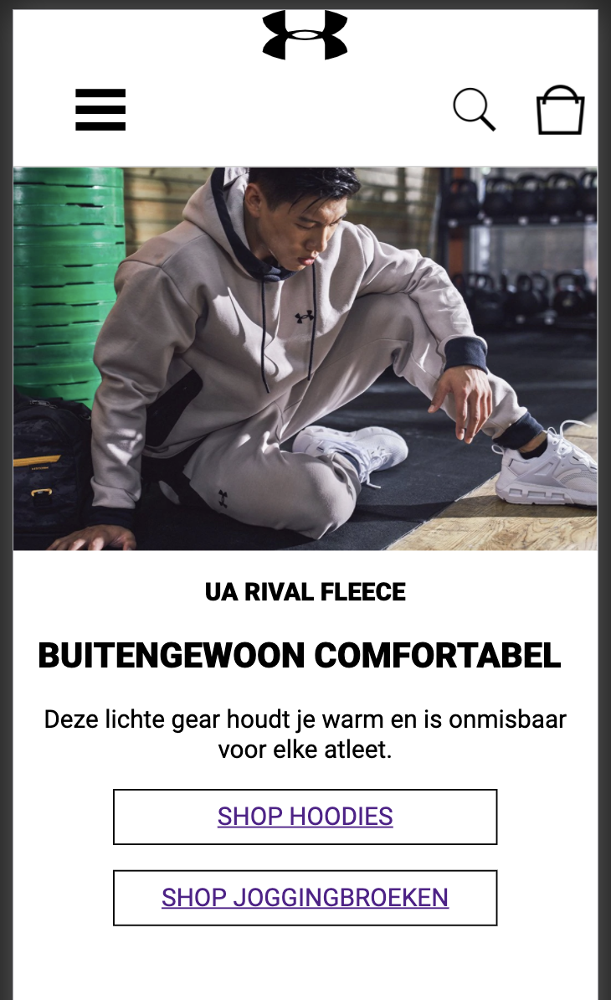
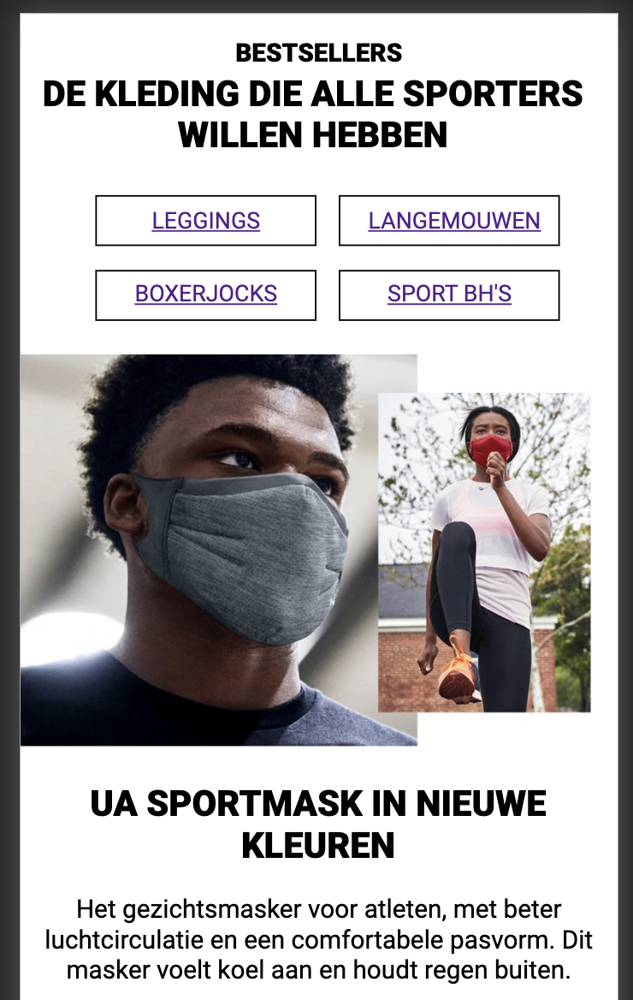
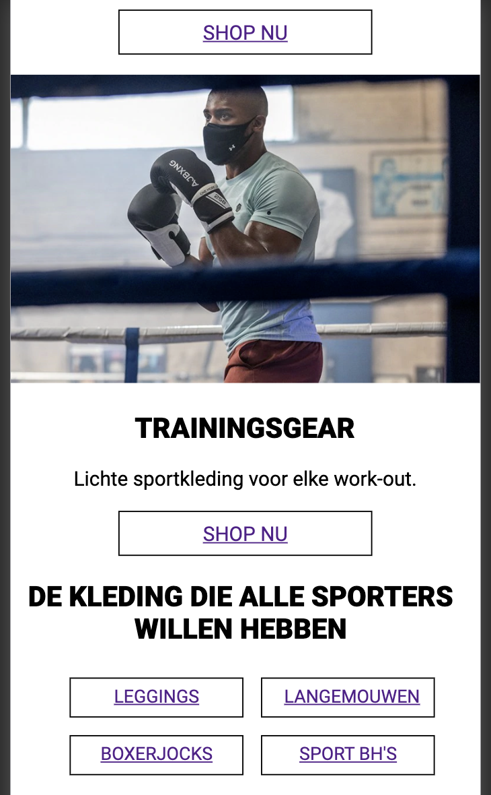
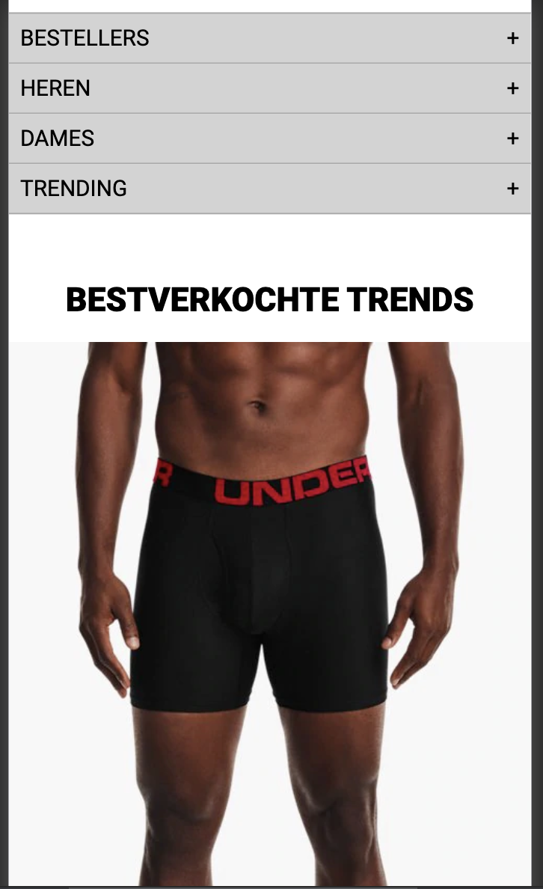
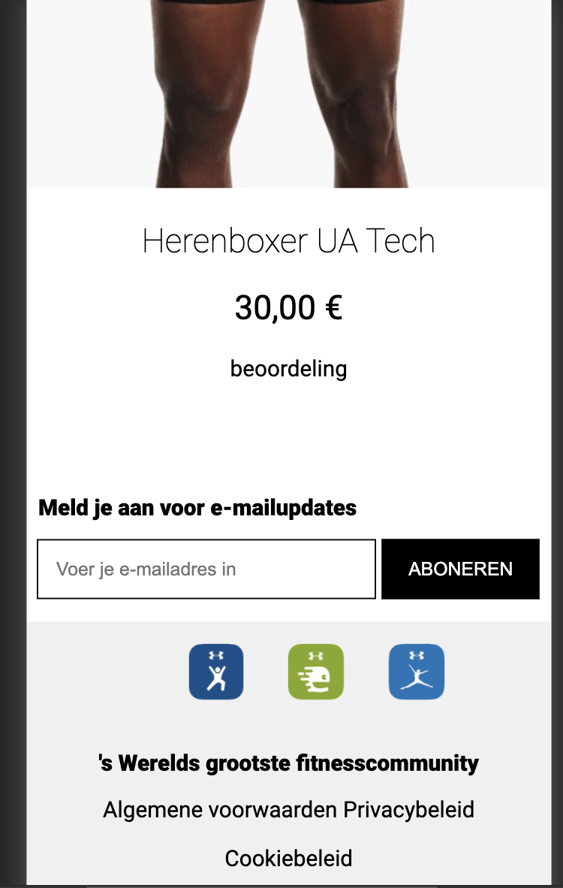

kleine dingen zoals het logo en wit ruimte rechts werkt niet zo goed :(

### Agenda voor meeting
 
-samen met je groepje opstellen-

| Emma | Jon | Charlie | Nine | Martijn |
| --- | --- | --- | --- | --- |
| Waarop letten bij responsive | w3c validator | w3c validator | w3c validator | :nth-of-type |
| font probleem | header probleem | ... | background-image | ... |
| w3c validator | ... | ... | ... | ... |

### Verslag van meeting

-na afloop snel uitkomsten vastleggen-

## Breakdownschets (week 1)

## Intake (week 1)
-uitwerken voor de kick-off werkgroep - begin van de eerste week-

**Je startniveau:** blauw

**Je focus:** surface plane

**Je opdracht:** https://www.underarmour.nl/nl-nl/

**Screenshot(s) van de eerste pagina (small screen):**

**Screenshot(s) van de tweede pagina (small screen):**

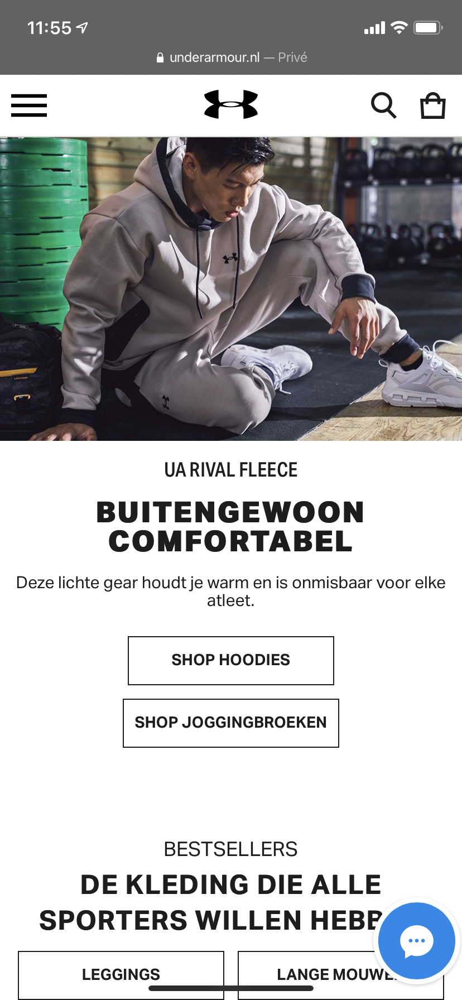
